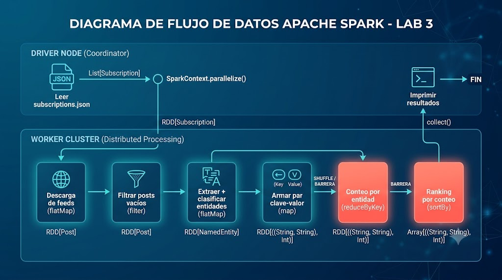

# Ejercicio 1 — Arquitectura del pipeline distribuido

**a) Arquitectura y flujo de datos del pipeline:**

A continuación se presenta el diagrama general del pipeline de procesamiento diseñado, ilustrando el flujo de los datos desde el origen en el Driver, su paso por el clúster (Workers/Shuffle) y el retorno de los resultados finales:

Este diagrama se traduce en las siguientes transformaciones y operaciones dentro de Spark. En la siguiente tabla se detalla el tipo en Scala de cada conexión, la operación aplicada y dónde se ejecuta:

| De → A | Operación | Tipo de la conexión | Dónde corre |
|--------|-----------|---------------------|-------------|
| Archivo → suscripciones | lectura del JSON | `List[Subscription]` | Driver |
| Suscripciones → RDD | `parallelize` | `RDD[Subscription]` | Driver → cluster |
| Descarga de feeds | `flatMap` | `RDD[Post]` | Workers |
| Filtrado de vacíos | `filter` | `RDD[Post]` | Workers |
| Extracción + clasificación | `flatMap` | `RDD[NamedEntity]` | Workers |
| Armado del par clave-valor | `map` | `RDD[((String, String), Int)]` | Workers |
| Conteo por entidad | `reduceByKey` | `RDD[((String, String), Int)]` | Shuffle (barrera) |
| Ranking | `sortBy` | `RDD[((String, String), Int)]` | Shuffle (barrera) |
| Impresión | acción (`collect`/`foreach`) | `Array[((String, String), Int)]` | Driver |

*(Nota: La clave `(String, String)` representa el par `(tipo, nombre)` de la entidad y el `Int` es su conteo).*

Vale la pena señalar dos cosas clave del grafo: 
1. **El lugar de ejecución:** Los extremos corren en el driver y el cuerpo en los workers. La lectura del archivo produce una `List[Subscription]` que vive en el driver y recién se vuelve distribuida al pasar por `parallelize`. Del otro lado, la impresión es una acción que vuelve a concentrar el resultado en el driver.
2. **Mutación de tipos:** El tipo del dato va mutando a lo largo del pipeline (`Subscription` → `Post` → `NamedEntity` → par `((tipo, nombre), conteo)`), lo que deja en claro que cada etapa es una transformación de tipo, no una simple repetición del mismo dato.

---
**b)** Para cada paso del pipeline, determinen si puede expresarse como una de las abstracciones de Spark:

* **Conexión:** no lo podemos abstraer con estas transformaciones ya que esto lo ejecuta el Driver, no los workers. No se transforman datos, sino que se prepara el entorno y se establece el origen de la información.
* **Descarga:** lo podemos abstraer con **flatmap**. Cada tarea es independiente. Cada elemento de entrada (ej una suscripción/URL) puede producir una cantidad variable de resultados. Con flatmap aplanamos estas colecciones de distintas longitudes, y devolvemos directamente un [RDDPost] limpio.
* **Extracción y clasificación de entidades:** lo podemos abstraer todo junto con **flatMap**. Cada tarea es independiente y transforma cada elemento (el documento crudo) en una cantidad variable de resultados (cero, una o múltiples entidades ya procesadas y clasificadas).
* **Conteo:** lo podemos abstraer con **reduceByKey**. Como las entidades quedaron desparramadas por los distintos workers, necesitamos agrupar las que son idénticas para poder sumar sus apariciones. El total de una entidad depende de combinar la información de todos los elementos.
* **Ranking:** no lo podemos abstraer con estas transformaciones. Para ordenar los resultados de mayor a menor, Spark necesita ver todo completo. No alcanza con el trabajo aislado de cada worker, hay que juntar y cruzar toda la información del cluster para hacer un ordenamiento global, o mandarle todo al Driver para que arme el listado definitivo.

---
**c) Pasos del pipeline que son barreras:** 
 
* **Conteo:** Como una misma entidad pudo haber sido encontrada por varios workers distintos al mismo tiempo, ninguno puede dar el número total y definitivo por su cuenta. Todos tienen que frenar, avisar que terminaron su parte y empezar a cruzar la información para sumar las apariciones que quedaron desparramadas.
* **Ranking:** Para poder ordenar los resultados de mayor a menor, sí o sí necesitamos tener los números finales. No podemos ordenar nada globalmente hasta que absolutamente todos los workers hayan terminado el conteo y entregado sus resultados para ver bien todo completo.

**Pasos del pipeline que pueden ejecutarse independientemente:**

* **Descarga:** Cada worker agarra su parte de las URLs y baja el contenido por su cuenta. No necesitan coordinar absolutamente nada con los demás para poder avanzar.
* **Extracción y clasificación:** Cada worker toma los documentos que acaba de descargar, saca las entidades y las clasifica. Si un worker va más rápido que otro, sigue procesando sus elementos sin importarle que hace el resto. Como operan sobre cada documento por separado, acá no tenemos ninguna dependencia ni tiempos de espera.

---
**d) Restricciones que impone Spark sobre las funciones:**

* **Serialización (Todo tiene que poder viajar por la red):** El Driver agarra la función que escribimos (y todo su entorno capturado), la empaqueta y se la manda por la red a todos los workers. Por lo tanto, todo lo que esté adentro de esa función (variables, objetos, clases) tiene que ser "serializable" (convertible a bytes). Si le pasamos algo que no se puede empaquetar, como una conexión abierta a una base de datos o a un archivo local, Spark va a frenar todo y tirar un error `NotSerializableException` antes de arrancar, porque no sabe cómo mandarlo por el cable.
* **Estado compartido (Los workers son islas aisladas):** Cada worker ejecuta una copia de nuestra función y trabaja con su propia memoria aislada. Si intentamos modificar una variable global normal desde adentro de un map (ej un contador), cada worker va a sumar en su propia copia local, y el Driver nunca se va a enterar del resultado real. Para agregar o compartir información de forma segura entre todos, Spark nos obliga a usar sus abstracciones nativas (como `reduceByKey`) o herramientas específicas diseñadas para esto (como los Acumuladores o las variables Broadcast).
* **Efectos secundarios (No dejes rastros afuera):** Nuestras funciones tienen que ser "puras": agarran un dato, lo transforman y devuelven el resultado, sin alterar nada del mundo exterior. Como Spark está diseñado para tolerar fallos, si un worker se clava en la mitad del trabajo, Spark reinicia esa misma tarea en otro lado. Si nuestra función tenía el efecto secundario de insertar un registro, generaríamos inconsistencias o terminaríamos duplicando datos sin querer.

# Ejercicio 2 — Paralelizar la descarga de feeds

Decisiones de diseño:

* **Carga de suscripciones en el driver:** Usamos FileIO.readSubscriptions (que devuelve un Either para atajar errores de formato o archivo no encontrado) antes de paralelizar. Esto asegura que si el JSON inicial está roto o no existe, el programa corta de una sin levantar los workers al vicio.

* **flatMap para la descarga:** Usamos flatMap sobre el RDD de suscripciones porque cada URL nos puede dar N posts, o darnos cero si se cae la red o el parseo. Es la operación ideal para aplanar todo en un solo RDD[Post].

* **Manejo de fallos con Option/List.empty:** Dentro del flatMap, atajamos el resultado de downloadFeed con pattern matching. Si falla (devuelve None), imprimimos el warning y retornamos un List.empty[Post]. De esta forma aislamos el error y el pipeline sigue procesando los demás feeds.

* **Estadísticas mediante múltiples acciones y RDD auxiliares:** Para no romper la pureza de las transformaciones y evitar Accumulators (que pueden tener comportamientos raros si hay reintentos de tasks), armamos un downloadStatusRDD que simplemente mapea si la descarga y el parseo de cada feed fueron exitosos (Boolean, Boolean). Sobre ese RDD y el de posts filtramos y tiramos acciones como .count() y .mean() para calcular todas las métricas que pide la consigna.

---
## Pregunta: ¿qué pasaría si dejáramos propagar la excepción?

Si la función que se le pasa al flatMap no captura la excepción y la deja propagar,
falla la *tarea* (task) que estaba procesando esa partición. Spark reintenta esa tarea
varias veces (4 por defecto); si sigue fallando, **aborta el stage y, en consecuencia, el
job entero**. El resultado es que **un solo feed inválido tira abajo toda la descarga**:
se pierden los posts de todos los demás feeds, incluso los que se habían descargado
bien, porque el RDD nunca termina de materializarse.

Capturando la excepción dentro de la función y devolviendo List.empty[Post], el fallo queda acotado a ese elemento: ese feed aporta cero posts, el fallo se contabiliza luego mediante nuestro RDD de estado (downloadStatusRDD) y el resto del pipeline continúa normalmente. Es decir, transformamos un fallo fatal para el job en un fallo local y observable, que es justo lo que se espera de un sistema distribuido tolerante a fallos.

# Ejercicio 3 — Paralelizar el cómputo de entidades nombradas

Decisiones de diseño:

* **Broadcast del diccionario:** Cargamos el diccionario en el driver con `Dictionary.loadAll` y lo distribuimos con `sc.broadcast`. Si lo capturáramos directo en el closure del `flatMap`, Spark lo serializaría y mandaría con cada tarea individual. Con broadcast se envía una sola copia por worker y todos los tasks la reutilizan desde memoria local.

* **Pipeline encadenado sin collect intermedios:** Las tres transformaciones (`flatMap` → `map` → `reduceByKey`) se encadenan sin materializar el RDD entre etapas. El `collect()` se hace solo al final, cuando ya tenemos los conteos agregados, trayendo al driver muchos menos datos que si hubiéramos traído todos los posts o todas las entidades crudas.

* **typeStats calculado desde el mapa reducido:** Una vez que `reduceByKey` devuelve el mapa `((tipo, nombre) → count)`, los stats por tipo los calculamos agrupando ese mapa en el driver, sin ninguna acción adicional sobre el cluster.

---

## Pregunta: `reduceByKey` es una barrera de sincronización. ¿Qué ocurre en el cluster en ese punto? ¿Por qué es inevitable?

`reduceByKey` dispara un *shuffle*: Spark redistribuye todos los pares por la red para que cada clave `(tipo, nombre)` quede concentrada en un único nodo, que recién ahí puede sumar los 1s y dar el conteo final. Es inevitable porque el conteo de una entidad depende de cuántas veces apareció en cualquier post de cualquier worker; no hay forma de saber el total sin cruzar información de todos los nodos.

## Pregunta: ¿Qué restricciones debe cumplir la función que se le pasa a `reduceByKey`?

Tiene que ser **asociativa** y **conmutativa**. Spark puede combinar subtotales en cualquier orden y en múltiples pasadas (primero dentro del mismo worker, luego entre workers), así que la función tiene que dar el mismo resultado sin importar ese orden. La suma entera `(_ + _)` cumple ambas. Una diferencia `(_ - _)` no y daría resultados incorrectos.

## Pregunta: ¿Dónde se hace la lectura del diccionario? ¿En el driver o los workers?

En el **driver**, antes de cualquier transformación distribuida. Si se leyera dentro del `flatMap`, los workers necesitarían acceder al filesystem local del driver (imposible en un cluster real) y además lo leerían N veces innecesariamente, una por partición.

# Ejercicio 4 — Monitoreo del éxito de las tareas

**a) ¿Por qué los Accumulators solo deben usarse para métricas y no para tomar decisiones lógicas dentro de las etapas distribuidas del pipeline?**

Los acumuladores en Spark son variables con una propiedad fundamental: los *workers* solo pueden incrementar su valor (mediante operaciones asociativas y conmutativas), pero el único proceso autorizado para leer su valor final es el *driver*. 

Intentar usar un acumulador para tomar decisiones lógicas en las etapas distribuidas (por ejemplo, hacer un `if (miAccumulator.value > 10)` dentro de un `flatMap` o un `filter`) es inviable y rompe el modelo de ejecución por las siguientes razones:
1. **Invisibilidad en los Workers:** Mientras las tareas se ejecutan en los nodos esclavos, los *workers* no ven el estado global ni actualizado del acumulador. Si intentan leerlo, Spark arrojará un error o devolverá un valor local indeterminado.
2. **Evaluación Lazy:** Las transformaciones no se ejecutan cuando se declaran, sino cuando se dispara una acción terminal. Por ende, durante la construcción del pipeline, el acumulador mantiene su valor inicial (usualmente `0`), haciendo imposible que determine el flujo lógico de los datos.

**b) ¿En qué situación un Accumulator puede dar un valor incorrecto?**

Un acumulador puede arrojar un valor incorrecto (típicamente mayor al real) si se utiliza dentro de **transformaciones intermedias** (como `flatMap` o `filter`) y el cluster sufre **reejecuciones de tareas** debido a:
* Fallos de hardware o red en algún *worker*.
* Pérdida de particiones intermedias en memoria.
* **Ejecución especulativa:** Cuando Spark nota que un nodo está muy lento y decide lanzar la misma tarea en otro nodo en paralelo para ver cuál termina primero.

Como las transformaciones intermedias no son necesariamente atómicas ante fallos, si una tarea incrementa un acumulador y luego falla (o es descartada por ejecución especulativa), Spark reiniciará la tarea en otro nodo. Sin embargo, los incrementos computados en el intento fallido **no se revierten automáticamente**. Para garantizar acumuladores 100% exactos, Spark asegura que sus efectos secundarios solo se apliquen una única vez si se operan dentro de una **acción** (como `foreach`).

**c) ¿En qué momento del pipeline está disponible el valor de un Accumulator para ser leído por el driver?**

El valor de un acumulador está disponible para ser leído por el driver **únicamente después de que se haya completado una acción terminal** que involucre la etapa donde dicho acumulador fue modificado. 

En nuestro diseño, esto se observa claramente en dos momentos:
1. Los acumuladores de descarga y filtrado (`accFeedsSuccess`, `accFeedsFailed` y `accPostsFiltered`) se vuelven consistentes recién después de invocar a la acción `filteredPostsRDD.count()`. Antes de esa línea, su valor es cero debido a la evaluación perezosa (*lazy*) de Spark.
2. El driver realiza la lectura e impresión de los acumuladores en la sección final del script, garantizando que todas las etapas distribuidas del cluster se hayan ejecutado con éxito.

**d) Comparativa de rendimiento y tiempos de ejecución**

A continuación, se presentan los tiempos obtenidos al medir las distintas etapas del pipeline utilizando `System.currentTimeMillis()` en un entorno local ejecutado con la configuración `local[*]`:

| Archivo de Suscripciones | Tiempo Descarga + Filtrado (s) | Tiempo NER + Reducción (s) | Tiempo Total Pipeline (s) |
| :--- | :---: | :---: | :---: |
| `local_subscriptions.json` | 6.130 | 5.906 | 17.455 |
| `many_subscriptions.json`  | 6.144 | 5.727 | 17.183 |

**Análisis y Justificación del rendimiento:**

Al evaluar los resultados, se evidencia que para conjuntos de datos pequeños o locales (como `local_subscriptions.json`), el pipeline distribuido puede no mostrar una ventaja clara en tiempos respecto a una solución secuencial directa. Esto representa un comportamiento esperado debido al **overhead de inicialización de Spark**: instanciar la infraestructura del cluster local, configurar la `SparkSession` y coordinar los hilos del driver introduce un costo fijo inicial significativo.

Sin embargo, la verdadera fortaleza de la arquitectura se manifiesta al escalar el volumen de datos con `many_subscriptions.json`. Mientras que un enfoque secuencial sufriría una penalización lineal o cuellos de botella por memoria al procesar flujos masivos de posts, Spark distribuye la carga de cómputo de manera eficiente entre los cores disponibles. El costo de serializar las funciones y realizar el *broadcast* del diccionario de entidades hacia los workers se ve ampliamente compensado por la paralelización del análisis de texto (NER) y la reducción en paralelo mediante `reduceByKey`. Esto demuestra la capacidad de escalabilidad horizontal del sistema sin requerir modificaciones en la lógica del código fuente.

# Ejercicio 5 — Acceso a datos y estadísticas del resultado
 
Decisiones de diseño:
 
* **`cache()` sobre `filteredPostsRDD`:** Es el único RDD que se usa en más de una acción: primero en `.count()` para las estadísticas, luego en `.map(...).mean()` para el promedio de caracteres, y finalmente en el `flatMap` de NER. Sin cache, cada una de esas acciones recomputaría todo desde el principio, incluyendo las descargas HTTP. Con `.cache()` la primera acción materializa el RDD en memoria y las siguientes lo leen directamente desde ahí.
* **`unpersist()` en todos los puntos de salida:** Llamamos a `filteredPostsRDD.unpersist()` tanto en las salidas tempranas (no hay posts válidos, no existe el directorio de entidades) como al final del pipeline normal. Así liberamos la memoria del executor ni bien el RDD deja de ser necesario, sin esperar a que Spark lo descarte solo por presión de memoria.
* **No cacheamos `entityCountsRDD`:** Solo se usa en una acción (`collect()`), así que cachearlo sería un gasto de memoria sin beneficio.
---
 
## Pregunta: ¿Qué ocurriría si no llamaran a `cache()`?
 
Cada acción sobre `filteredPostsRDD` recomputaría todo el pipeline desde `sc.parallelize(subscriptions)`: volvería a hacer las descargas HTTP, el parseo y el filtrado. Con tres acciones sobre ese RDD (`count()`, `mean()` y el `flatMap` de NER), las descargas se ejecutarían **tres veces**. Para datasets grandes eso es inaceptable, y en un entorno con rate limiting o feeds inestables también produce resultados inconsistentes entre acciones.
 
## Pregunta: ¿Por qué es incorrecto llamar a `collect()` entre los pasos a) y b) del ejercicio 3 y luego continuar el pipeline?
 
Si llamáramos a `collect()` después del `flatMap` de entidades y antes del `map`/`reduceByKey`, traeríamos todas las entidades crudas al driver y haríamos el conteo secuencialmente ahí. El problema es doble: primero, rompemos la distribución del trabajo porque el conteo pasa a ejecutarse en un solo proceso; segundo, si hay muchos posts, el driver puede quedarse sin memoria al intentar acumular todas las entidades en un solo `Array`. El `collect()` debe hacerse lo más tarde posible, cuando los datos ya están agregados y son pocos.
 
## Pregunta: `cache()` es también lazy. ¿En qué momento se almacena realmente el RDD en memoria?
 
Llamar a `.cache()` solo marca el RDD como "a persistir", pero no ejecuta nada. El RDD se almacena en memoria recién cuando se dispara la **primera acción** que lo recorre, que en nuestro caso es `filteredPostsRDD.count()`. En ese momento Spark materializa las particiones y las guarda en la memoria de los executors. Las acciones siguientes (`mean()` y el `flatMap` de NER) ya encuentran las particiones cacheadas y las leen directamente sin recomputar.
